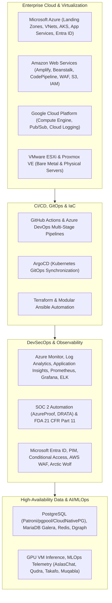

<div align="center">

# Anas Khan
### Senior DevOps / DevSecOps & Multi-Cloud Infrastructure Engineer
**Microsoft Azure Architecture &bull; AWS &bull; GCP &bull; Kubernetes &bull; Terraform &bull; GitOps &bull; Entra ID &bull; SRE**

[](mailto:anas.devops@hotmail.com)
[](https://linkedin.com/in/devanasops)
[](https://devanasops.github.io/devops-portfolio/)

<br/>

<!-- Tech Stack Badges with Official Brand Logos -->
<p align="center">
  
  
  
  
  
  
  
  
  
  
  
  
  
  
  
  
</p>

</div>

---

## Executive Engineering Summary

Senior DevOps & Multi-Cloud Infrastructure Engineer with 5+ years of experience architecting, securing, and automating high-availability cloud platforms across **Microsoft Azure, AWS, and GCP**. Proven track record leading hybrid-cloud migrations, architecting enterprise **Azure Landing Zones**, engineering automated **GitOps & CI/CD delivery pipelines**, deploying **GPU AI/MLOps runtimes**, and establishing zero-trust compliance standards (**SOC 2, FDA 21 CFR Part 11**).

---

## Quantified Engineering Impact

```
+------------------------+------------------------+------------------------+
|       MTTR Cut         |   Release Velocity     |    Manual AWS Effort   |
|         -60%           |         +40%           |         -70%           |
| (Azure Monitor / Logs) | (Azure VMs + Actions)  | (CodePipeline + WAF)   |
+------------------------+------------------------+------------------------+
|   Database Availability|   AI Platform Uptime   | K8s Provisioning Speed |
|        99.95%          |         99.9%          |   4 hrs -> <20 mins    |
| (Patroni / Galera HA)  | (AslasChat / Takafo)   | (ArgoCD + Hetzner)     |
+------------------------+------------------------+------------------------+
```

* **60% Reduction in MTTR:** Architected centralized telemetry across multi-subscription Azure workloads using Azure Monitor, Log Analytics Workspaces, and Application Insights.
* **40% Accelerated Release Velocity:** Built automated GitHub Actions & Azure DevOps CI/CD pipelines for containerized workloads on Azure VMs across 8+ commercial platforms (Aslase).
* **70% Reduction in Manual Deployment:** Engineered automated AWS delivery (Amplify + Elastic Beanstalk + CodePipeline) reinforced by AWS WAF.
* **99.95% Production Database Uptime:** Engineered zero-downtime HA clusters for PostgreSQL (Patroni, pgpool, CloudNativePG) and MariaDB Galera (MaxScale).
* **UAE Government Cloud Architecture:** Designed High-Level Design (HLD), network isolation, GPU VMs, Private Endpoints, and multi-stage release pipelines for the **DGE-Mawaheb** government initiative.
* **SOC 2 Audit Prep (Days → Hours):** Enforced automated control verification using **AzureProof** live configuration auditing and DRATA test suites.
* **Medical Compliance Automation:** Formulated Software Validation Protocols (SVP) and Verification Reports (SVR) satisfying FDA 21 CFR Part 11 medical standards at THINK Surgical.

---

## Multi-CV Hub & Resume Portfolio Showcase

This repository maintains 5 master resume versions across career progression, generated in **Responsive HTML**, **Print-Ready PDF**, and **Clean Markdown**:

| Version | Focus & Specialization | Interactive HTML | Downloadable PDF | ATS Markdown |
|---|---|---|---|---|
| **CV #5** | ⭐ **Lead Azure Cloud Engineer & SRE (Current Flagship)**<br>*(UAE Gov DGE-Mawaheb HLD, GPU VMs, Redis, Private Endpoints, Aslase 8+ Platforms, AzureProof SOC 2)* | [View HTML](resumes/Anas_Lead_Azure_DevOps_Cloud_Engineer.html) | [Download PDF](pdf/Anas_Lead_Azure_DevOps_Cloud_Engineer.pdf) | [Read MD](markdown/Anas_Lead_Azure_DevOps_Cloud_Engineer.md) |
| **CV #4** | **Senior Azure Cloud Architect & Entra Lead**<br>*(Azure Landing Zones, Entra ID Governance, Conditional Access, PIM, AzureProof SOC 2)* | [View HTML](resumes/Anas_Senior_Azure_Cloud_Architect.html) | [Download PDF](pdf/Anas_Senior_Azure_Cloud_Architect.pdf) | [Read MD](markdown/Anas_Senior_Azure_Cloud_Architect.md) |
| **CV #3** | **Senior Azure Cloud & SRE Specialist**<br>*(Azure DevOps, SRE Telemetry, MTTR -60%, IBHC.ai, Aslase, Vizzn Inc, DRATA)* | [View HTML](resumes/Anas_Senior_Azure_DevOps_SRE.html) | [Download PDF](pdf/Anas_Senior_Azure_DevOps_SRE.pdf) | [Read MD](markdown/Anas_Senior_Azure_DevOps_SRE.md) |
| **CV #2** | **Senior Multi-Cloud & AI Infrastructure Lead**<br>*(AWS Amplify/Beanstalk/WAF, Azure Portal Consolidation, GCP, AI Platforms: AslasChat, Qudra, Takafo)* | [View HTML](resumes/Anas_Senior_DevOps_Cloud_Engineer.html) | [Download PDF](pdf/Anas_Senior_DevOps_Cloud_Engineer.pdf) | [Read MD](markdown/Anas_Senior_DevOps_Cloud_Engineer.md) |
| **CV #1** | **DevOps & Systems Engineering Foundation**<br>*(Linux admin, Bare metal, ArgoCD GitOps, CloudNativePG, PostgreSQL Patroni, MariaDB Galera)* | [View HTML](resumes/Anas_DevOps_Engineer_Foundation.html) | [Download PDF](pdf/Anas_DevOps_Engineer_Foundation.pdf) | [Read MD](markdown/Anas_DevOps_Engineer_Foundation.md) |

---

## Technical Competency Matrix



---

## Repository Structure

```
├── index.html                  # GitHub Pages Portfolio Showcase Portal
├── resumes/                    # Interactive Responsive HTML Resumes (SVG brand logos, @media print)
│   ├── Anas_Lead_Azure_DevOps_Cloud_Engineer.html
│   ├── Anas_Senior_Azure_Cloud_Architect.html
│   ├── Anas_Senior_Azure_DevOps_SRE.html
│   ├── Anas_Senior_DevOps_Cloud_Engineer.html
│   └── Anas_DevOps_Engineer_Foundation.html
├── pdf/                        # Print-Ready PDFs (Compiled via WeasyPrint engine)
│   ├── Anas_Lead_Azure_DevOps_Cloud_Engineer.pdf
│   ├── Anas_Senior_Azure_Cloud_Architect.pdf
│   ├── Anas_Senior_Azure_DevOps_SRE.pdf
│   ├── Anas_Senior_DevOps_Cloud_Engineer.pdf
│   └── Anas_DevOps_Engineer_Foundation.pdf
├── markdown/                   # Standard ATS-Optimized Markdown Source Files
│   ├── Anas_Lead_Azure_DevOps_Cloud_Engineer.md
│   ├── Anas_Senior_Azure_Cloud_Architect.md
│   ├── Anas_Senior_Azure_DevOps_SRE.md
│   ├── Anas_Senior_DevOps_Cloud_Engineer.md
│   └── Anas_DevOps_Engineer_Foundation.md
├── knowledge_base/
│   └── MASTER_SYNTHESIS.md     # Hot-Reload Master Synthesis of all career metrics & tech stacks
└── scripts/
    └── generate_pdf.py         # WeasyPrint PDF compilation utility
```

---

## Quickstart & Deployment

### 1. Local Preview
Serve the portfolio hub locally using Python's built-in web server:
```bash
python3 -m http.server 8080
# Open http://localhost:8080 in your browser
```

### 2. GitHub Pages Deployment
1. Push this repository to GitHub.
2. Navigate to **Settings** > **Pages**.
3. Under **Build and deployment** > **Source**, select `Deploy from a branch`.
4. Choose branch `main` (or `master`) and directory `/ (root)`.
5. Click **Save**. Your live showcase will be active at `https://<your-username>.github.io/<repo-name>/`.

---

## Contact & Professional Profiles

* **Candidate Name:** Anas Khan
* **Universal Email:** [anas.devops@hotmail.com](mailto:anas.devops@hotmail.com)
* **LinkedIn:** [linkedin.com/in/devanasops](https://linkedin.com/in/devanasops)
* **Phone:** `+92 317 694 7473`
* **Location:** Lahore, Pakistan &bull; Available for Remote & Global Opportunities
